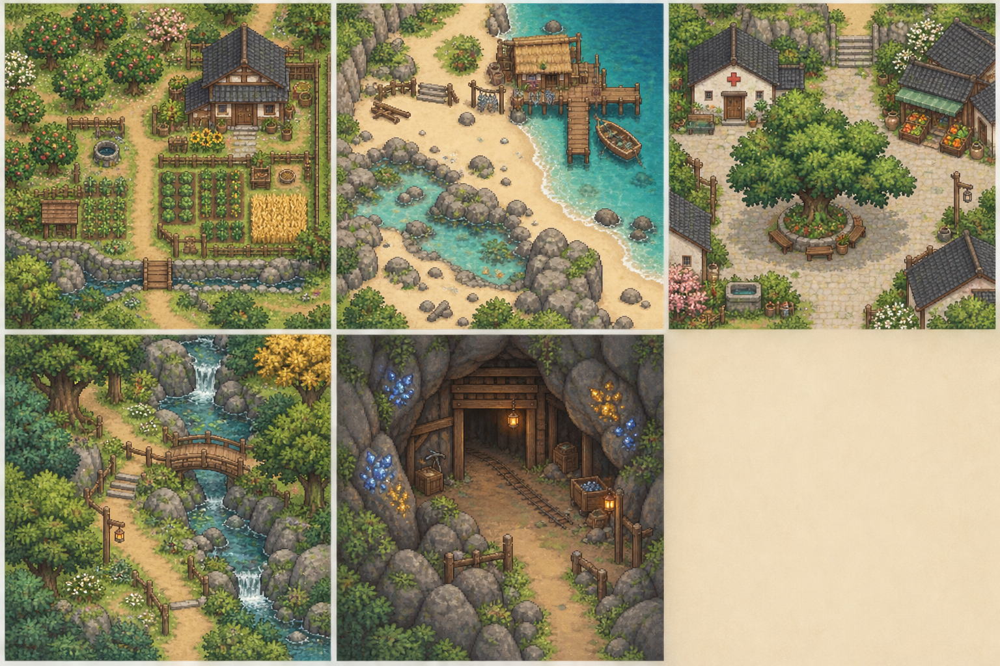

# 星露谷场景参考与花溪原创方向

调查日期：2026-09-24。用途是观察场景组织与游戏画面阅读方式，不复用星露谷截图、地图、角色、建筑或贴图。

## 参考来源与观察

- [星露谷官方媒体页](https://www.stardewvalley.net/media/)提供官方游戏截图；重点观察角色、地块、建筑、HUD在同一画面里的相对比例，以及玩家可活动空间如何由道路和物件边缘界定。
- [鹈鹕镇地点资料](https://stardewvalleywiki.com/Pelican_Town)描述广场与农场、森林、沙滩、山地之间的连接，以及镇内服务建筑和居民的分布。可以借鉴的是“中心公共空间连着不同生活用途”的拓扑，而不是照抄具体地图。
- [海滩地点资料](https://wiki.stardewvalley.net/The_Beach)指出海岸由码头、渔屋、潮池、拾贝区域和通路共同构成；拾取与海钓活动直接由地标支持。对应到花溪，沙滩应能让玩家一眼读出潮线、可行走的湿沙、钓鱼位置和潮池方向。

## 对花溪当前版本的判断

项目已经有农场、郊区、小镇、沙滩和山洞五区，使用实体路标提供地点说明；也已有海岸物件、树带、商店/诊所、矿洞支架与不同楼层矿物。小镇现有运行截图 `../../qa/2026-09-24/stardew-reference/town-square.png` 中，商店、诊所、田块与中央玩家位置清楚，但地面纹理比人物/居民更抢眼，空地较多，建筑间的公共空间连接还可以更连贯。海滩截图 `../../qa/2026-09-24/stardew-reference/beach-scene.png` 已包含沙地、木栈道、潮池、渔屋、海面动态浪花，但入口视角没有同时展示渔屋和完整岸线，第一眼的空间层次偏弱。

当前查看的截图覆盖城镇和沙滩；五区其余场景需要后续统一倍率捕捉后再逐区审查，不能凭本次两张图宣称全区视觉验收完成。

## 花溪的原创视觉方向板

该图由内置图像生成工具原创生成，作为农场、海滩、小镇、郊区和洞穴的氛围与构图参考，不是游戏内贴图。图中细节和比例仍需拆解为适配32像素地图格与现有角色比例的原生素材。

## 实施优先级

1. **先校准场景构图。** 同一游戏分辨率、镜头缩放和人物落点下，分别捕捉五区入口、地标和核心活动区。玩家反馈角色在场景中仍偏小，因此镜头由1.5倍调整到1.75倍；下一轮对五区都要检查放大后地标是否仍完整、出口提示和核心路径是否留在画面内。优先减少路面/地表噪声，用树冠、遮棚、岩石、栏杆和植被组形成远近层次，同时保留清楚的通行路径。
2. **让地标服务于玩法。** 小镇以中央树荫/长椅/公告板作为聚集核心，建筑门前铺装连成可读路径；沙滩把渔屋、码头、浪线、拾贝带和潮池组织成一条可步行探索路线；郊区让溪桥和林缘导向山洞；农场用栅栏、田埂、果树和出货箱形成日常工作动线；洞穴用木支撑、矿脉、灯火与可见梯子表现深度。
3. **统一素材契约。** 新物件按现有透明 PNG 图集、32像素单元、脚底锚点、遮挡排序与碰撞数据接入；地图数据仍是通行/阻挡真相。任何路牌说明继续通过靠近阅读面板查看，地面和人物头顶不添加文字。
4. **用实机画面验收。** 每区至少留入口全景和主要活动特写，检查角色是否清楚、路是否可读、地标是否完整进入镜头、交互点是否被遮挡，并在缩放/窗口尺寸下复核。改动地形后跑区域移动、路标和NPC交互回归。

## 已有画面证据

- 城镇：`../../qa/2026-09-24/stardew-reference/town-square.png`
- 沙滩：`../../qa/2026-09-24/stardew-reference/beach-scene.png`
- 现有五区玩法规划：[`../../2026-09-21-farm-experience-plan.md`](../../2026-09-21-farm-experience-plan.md)

本次没有把方向板作为游戏资产接入；它用于后续生产符合现有像素分辨率、可碰撞地图契约的原创物件和场景素材。

## 2026-09-24 补充核对

- [官方媒体截图页](https://www.stardewvalley.net/media/)中的场景画面用于对照人物、地块、建筑和界面的相对关系；截图只作为观察材料。
- [Steam官方介绍与截图](https://store.steampowered.com/app/413150/Stardew_Valley/)确认原作将农场经营、五类技能、居民日程、季节活动、洞穴探索、钓鱼和社区修复相互连结。对花溪的借鉴重点是每次外出都能带回推进农场/社区的东西，而不是增加互不相干的地图装饰。
- [地点索引](https://stardew.wiki/locations/)列有海滩、城镇、森林和山地区域；[沙滩资料](https://wiki.stardewvalley.net/The_Beach)把渔店、码头、潮池、拾贝和活动空间放在同一片海岸；[采矿资料](https://wiki.stardewvalley.net/Mining)说明矿脉、工具等级与素材成长互相制约。由此给花溪的场景规划增加一条共同验收标准：地标必须提示活动，活动必须产出能用于成长的物品。
- 以实际游戏画面判断，目前城镇的服务建筑和广场中心已经容易识别；郊区主路很清楚，但铺装和草纹仍较抢眼；海滩栈台可见，入口视角没有同时包含渔屋与完整岸线；洞穴有矿脉和支撑架，后续更适合增加分层氛围与路线目标，而不是继续叠同形矿石。

## 2026-09-24 在线画面复核与场景补充决策

本轮重新查看了[官方截图页](https://www.stardewvalley.net/media/)和[Steam官方截图/玩法页](https://store.steampowered.com/app/413150/Stardew_Valley/)，并把画面阅读方式对照到项目当前D3D12截图。重点借鉴的是：人物保持醒目但不压过活动地标；地表相对安静；主要路线由建筑、植被和边界围出；海岸与洞穴的玩法目标直接出现在玩家视线方向。原作截图、地图、角色和贴图都不导入。

这一对照确认，花溪的五区和路标基础已经落地，下一步应优先补场景层次与入口构图，而非再增加地面说明文字。当前可见短板和追加顺序如下：

1. 沙滩入口首屏尚未同时讲清入口、渔屋、潮池和岸线。调整入口构图，让玩家进入后能沿沙地走向栈台/渔屋，并在视野内看到潮池和水线；浪花动画继续只作装饰，不改水域碰撞或拾贝点。
2. 郊区草纹与道路边缘仍较醒目。降低小范围地表细节的对比度，把树、灌木、溪桥和休息点按组布置，保持农场至小镇、山洞、海滩四条出口清晰。
3. 洞穴的楼层色调已能区分，仍需让入口营地、普通矿层和深层矿区出现不同的岩壁/支撑轮廓与目标分布；灯光只强化路径和矿点可读性，不把整屏照亮。
4. 小镇广场中心已建立，继续把商店、住宅和公共休息区用连续街道及居民日常路线连接；农场则补动物围栏、院门与作业路径之间的生活层次。

实现验收沿用现有素材契约：原创透明像素素材、32像素格、脚底锚点、实体碰撞范围与地图数据分开维护；路标表面不写地点名，地点说明按键阅读，地面和人物头顶保持无文字。每项场景改动都留同倍率入口截图和活动特写，并跑对应区域行走/路标/NPC交互回归。

## 沙滩入口实装复核

已按本节优先级调整沙滩入场点、海岸线、栈台和相机取景，并接入原创海岸物件图集。D3D12入口截图 `../../qa/2026-09-24/stardew-reference/beach-entry.png` 现在同时呈现可见主角、渔屋、近岸活动物件与海面；近岸截图 `beach-landing.png` 展示潮池和栈台路线。`regional_world_test.gd` 实机328项、钓鱼与NPC相关headless回归均通过。剩余工作转为精修海岸细节密度、潮汐时段变化与动态海鸟/蟹类玩法，不把静态装饰误记为互动系统。

## 郊区溪桥补充

本轮再次查看[星露谷官方媒体页](https://www.stardewvalley.net/media/)中的游戏截图，把注意力放在玩家如何一眼读出路径跨越水面的连接关系。花溪郊区原有溪流和可通行路面交叉，但视觉上像普通泥路直接压过溪水。现在在绘制层给交叉点增加窄木桥、横向木板、低栏和立柱，使“沿林路过桥”的方向更明确；仅重绘既有8×5路径覆盖里的4×3通行核心，没有更改地形、水域、碰撞或出口。

实机截图更新为 `../../qa/2026-09-24/stardew-reference/countryside.png`。首次截图发现桥绘制得覆盖整条路，过度抢眼；随后收窄到溪流与道路交叉宽度，复查后两侧草地和连续主路仍清楚，人物脚下可通行。后续为降低郊区草地的重复花纹，新增原创 `countryside_grass_v1.svg` 8×8瓦片集：统一底色、低对比草簇和稀疏野花，仅替换郊区草面。首次草地截图出现方格色块，已统一底色并重拍，画面保留自然的小草细节，路面与林缘地标仍突出。

`regional_world_test.gd` 现共329项、0失败，新增溪桥中心格仍是可行走路面的断言。桥仍是环境装饰，没有独立交互或过桥动作；入口视角周边留白仍较大，后续需继续检查溪桥、树带与洞口能否在玩家实际路线中形成清晰纵深。

## 2026-09-25 在线游戏画面补充

本轮补看了[星露谷官方媒体截图](https://www.stardewvalley.net/media/)、[Steam 官方游戏画面与玩法介绍](https://store.steampowered.com/app/413150/Stardew_Valley/)，并按区域查看了几张公开实机图：[农场作物分区示例](https://dotesports.com/general/news/how-to-make-a-scarecrow-in-stardew-valley)、[鹈鹕镇广场示例](https://www.eneba.com/hub/games/best-steam-deck-games/)、[沙滩全景图](https://stardewvalleywiki.com/File:Beach_Overview.jpg)和[矿洞实机示例](https://www.bisecthosting.com/blog/stardew-valley-mine-guide-floors-enemies-loot)。这些截图只用于分析游玩画面的构图、活动焦点和颜色层级，未下载或导入项目；第三方截图仍归原作者/游戏版权方所有。

补充观察：农场截图把可耕作区收成边界清楚的几组，建筑、树和栅栏围住工作动线，空地因此显得有用途；小镇截图由铺装广场和一棵醒目的中心树构成视觉锚点，服务建筑沿广场边缘分布；沙滩全景同时交代陆地、海岸线、桥和潮池之间的通路；矿洞用成组岩壁、矿点、梯子和局部灯光提供探索目标。共同点是装饰围绕活动布置，玩家无需读地面提示文字也能判断往哪里走、可以做什么。

落实到花溪五区时：农场先把作物地、动物院落、出货与加工点围成几组，保留连续的院间空地；沙滩保持入口至渔屋/栈台/拾贝岸线的连续视线；小镇让广场铺装、树荫休息区和服务门口连成一个公共空间；郊区用林缘和溪桥引导去洞口、沙滩与农场的道路；山洞让梯子、矿脉和灯火形成由入口到深层的路线提示。优先补“地标之间的空间关系”，不继续堆叠高对比草纹或同形小物件。所有后续美术仍按花溪原创透明像素素材和地图碰撞数据接入；地点说明继续由实体路标靠近阅读，地面及人物头顶不放文字。

## 2026-09-24 官方画面复看与场景补充顺序

本次重新查看[星露谷官方媒体截图页](https://www.stardewvalley.net/media/)和[Steam官方截图/玩法页](https://store.steampowered.com/app/413150/)，并对照[鹈鹕镇地点资料](https://stardewvalleywiki.com/Pelican_Town)、[海滩地点资料](https://wiki.stardewvalley.net/The_Beach)和[地点索引](https://stardew.wiki/locations/)。只借鉴画面组织与玩法关联；原作截图、地图、角色和贴图都不放进花溪项目。

| 区域 | 参考画面的组织规律 | 花溪下一步补充 |
| --- | --- | --- |
| 农场 | 农舍、田地、收纳和加工点围绕日常工作路线分组，草地留出空白 | 降低田埂与地表边线对比，把作物区、加工区、动物院落分成清楚的几组，再补棚屋、鸡舍、围栏与院门之间的连接；暂不继续增加碎花纹 |
| 沙滩 | 入口、住屋/渔屋、栈台、钓点和拾贝岸线构成连续的探索路线 | 已有渔屋、栈台、潮池、海鸟和贝壳。下一步让潮线、可钓水边和拾贝带各自成组，少量岩礁围出路径，控制重复小纹理 |
| 小镇 | 服务建筑、居民活动区与通往周边地区的出口由公共空间串联 | 商店、诊所、咖啡馆、广场树和长椅已齐；继续强化从农场入口经过广场到服务建筑的连续路面，让树荫与长椅成为居民停留点 |
| 郊区 | 林缘、道路、溪流与桥连接不同生活区域，植被边界同时形成前后层次 | 已有溪桥、低对比草地和四向出口。补树带/矮篱的分组层次，以及朝山洞方向的坡脚或岩壁轮廓，不缩窄当前可走路线 |
| 山洞 | 岩壁、支撑结构、光源与矿点密度表达探索深度 | 入口、支撑、矿脉、梯子及楼层色调已具备；优先区分入口营地、普通矿层和深层目标，避免同形矿点平均铺满或仅靠全屏变暗制造深度 |

和参考截图相比，当前运行画面里常驻操作提示、宽顶栏和底部热栏占去较多视野。下一轮构图验收需要同时捕捉完整HUD与纯世界画面，分别检查玩家/地标比例和界面占屏；人物已使用1.75倍镜头设置，继续放大前先确认五区地标和道路不会被裁掉。

现有[花溪五区原创方向板](huaxi-five-regions-art-direction-v1.png)仍是概念参考，不是运行时贴图。原计划为补齐方向板空白格增加一幅郊区林道概念画，但本次内置图像生成请求连接失败，因此没有替换或改动现有图片；后续素材仍须按原创透明像素图、32像素格、脚底锚点和地图碰撞契约制作。路标只提供可阅读信息，地面和人物头顶继续保持无文字。

## 2026-09-25 在线截图与场景资料补充

本轮重新查看[官方媒体截图](https://www.stardewvalley.net/wp-content/uploads/2016/02/StardewValley_4_1-1024x576.png)、[Steam官方游戏页](https://store.steampowered.com/app/413150/Stardew_Valley/)，并查阅[鹈鹕镇](https://stardewvalleywiki.com/Pelican_Town)、[海滩](https://stardewvalleywiki.com/The_Beach)、[农场地图](https://stardewvalleywiki.com/Farm_Maps)和[采矿](https://stardewvalleywiki.com/Mining)页面。官方图只供画面比例和场景构图观察，地点资料帮助核对区域连接与活动；均未下载或作为花溪素材。

从截图中提取的可用规律是：以人物实际能走到的空间为画面中心，建筑/树冠围出边界，地面用较大块、较低对比的颜色托住农田、路和角色；物件摆放同时交代用途和行进方向。Steam页面概述也把耕作、饲养、居民日程、节日、洞穴与社区修复连在同一乡村生活循环中。沙滩资料进一步核实了海边可以将渔屋/码头、潮池和季节性拾取带分区，并让桥或道路成为通往东侧探索区的空间目标，而不是把装饰平均铺满海岸。

| 花溪区域 | 参考后要强化的画面信息 | 场景实施重点 |
| --- | --- | --- |
| 农场 | 一眼分清作物作业区、动物院落和生活区 | 让田垄、围栏、院门与出货点串成一条短动线；大型空草地留给扩建，不再增加高对比草纹 |
| 沙滩 | 清楚呈现入口、海岸线、渔屋/栈台和潮池之间的关系 | 入口镜头优先保留栈台与一段岸线；拾贝只落在可走沙带，潮池与深水色块区分用途 |
| 小镇 | 广场是中心，服务建筑和居民活动沿边界组织 | 维持铺装广场作为集散区；把店门、长椅/树荫和通往周边区域的路连起来，留出居民可驻足的边缘 |
| 郊区 | 林缘和溪桥解释“路通向哪里” | 用成组树丛、溪桥、岩脚与路边休息点分段提示去向；保留主路宽度和四个出口的识别 |
| 山洞 | 看见入口安全区、矿点目标和继续深入/返回路径 | 以支撑架、局部火光和岩壁分段构图；矿点留空隙和纵深，不做平均网格铺点 |

实施顺序按现有运行截图确定为：①五区各拍一张同镜头入口图，标记玩家、主地标和可走路径；②先修入口视线被裁切或地标关系不清的问题；③再调草地/沙地/岩地纹理强弱与成组装饰密度；④最后补天气、时间和节日的小型画面变化。镜头已提供1.50×/1.75×/2.00×设置档位，因此每次构图验收固定倍率并同时检查地标完整度。所有方向牌都作为可读的路边实体，阅读后显示地点信息；地面不画地点字，角色上方不画姓名、地点名、交互文字或奖励飘字。

实际游戏参考图：

## 2026-09-25 官方场景复看与地图地标

重新查看[星露谷官方媒体截图页](https://www.stardewvalley.net/media/)及[官方新闻资料页](https://www.stardewvalley.net/press/)，并对照[农场地图类型](https://wiki.stardewvalley.net/Farm_Maps)。参考重点是各场景用空间布局表达用途：农场有连续耕作区和林缘，海岸同时出现陆地、浅水、码头与拾取带，城镇由服务建筑围合公共空间，洞穴用岩壁、矿点和向下探索的目标组织视线。原作图片仅在线浏览，没有加入项目。

本轮在花溪旅行地图的小比例区域图上继续强化实际地图对象对应的建筑、树木、广场设施、海岸拾取物和洞穴矿脉形状。洞穴标记以原创的矿石切面替代同样大小的圆点，保持地点/物品文字只出现在手册界面；农场、郊区、城镇和海滩的路线仍取自导航地图数据。五区D3D12捕捉已留档于 `../../qa/2026-09-25/map-region-art/`。地图截图发现镇区、郊区和海滩的竖线越过小地图，排查后确认来自长凳腿而非路灯；长凳改用短块腿，复拍后长线消失，路和建筑仍可辨。官方Godot 4.7.1引擎经发布SHA-256核验后已放入独立缓存；`map_overview_test.gd` 25项、`resident_crowd_test.gd` 0失败、`game_smoke_test.gd`通过。洞穴地标和新长凳细节现已具备引擎渲染检查。

## 2026-09-25 按在线场景图补充五区观察

本轮浏览了[星露谷官方媒体截图](https://www.stardewvalley.net/media/)和[Steam官方截图组](https://store.steampowered.com/app/413150/Stardew_Valley/)，并用[沙滩窄海湾/渔屋画面](https://www.gamesradar.com/stardew-valley-update-gives-players-beach-farm-and-split-screen-co-op/)与[山地湖岸画面](https://gamenews.es/los-mejores-lugares-para-pescar-en-stardew-valley/)交叉观察。后两者是媒体游戏截图，只作构图参考。

- 农场与小镇：屏幕里同时留出角色脚下可走地面、主要劳动/交互对象和一条能读懂的路；新增物件应围绕活动点分组，不靠铺满小装饰制造细节。
- 沙滩：沙地、湿岸、深水、码头或小渔屋组成不同色块与探索目标；需要让入口画面读出海岸方向，拾贝落在可行走的岸带。
- 山洞与山地：深水/岩岸/木桥或洞壁/矿点/梯子形成方向性，玩家在画面中的活动空间要有边界和继续探索的目标。
- 郊区与林地：树群、溪流和桥各自成为路线边缘与去向提示，仍要给道路留出连续宽度。

花溪五区的现有构图已按这些规律拆成原创地图对象和像素素材任务，具体实现进度见 `../../IMPLEMENTATION_PROGRESS.md`。不下载或复用原作地图、角色和贴图；地面及人物头顶继续保持无文字，地点说明通过路标阅读。
